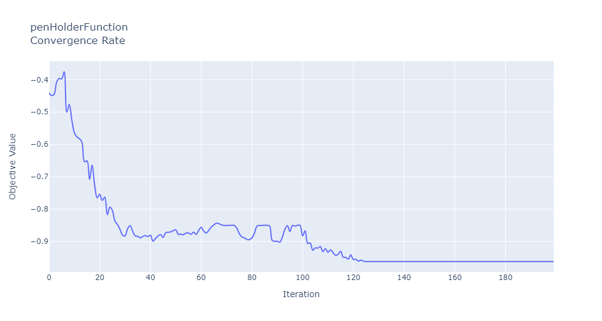
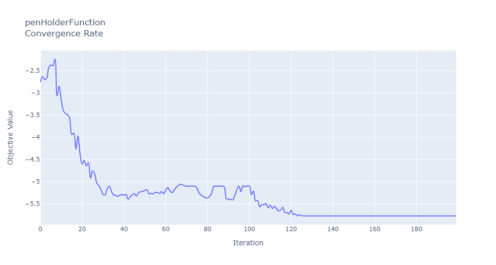
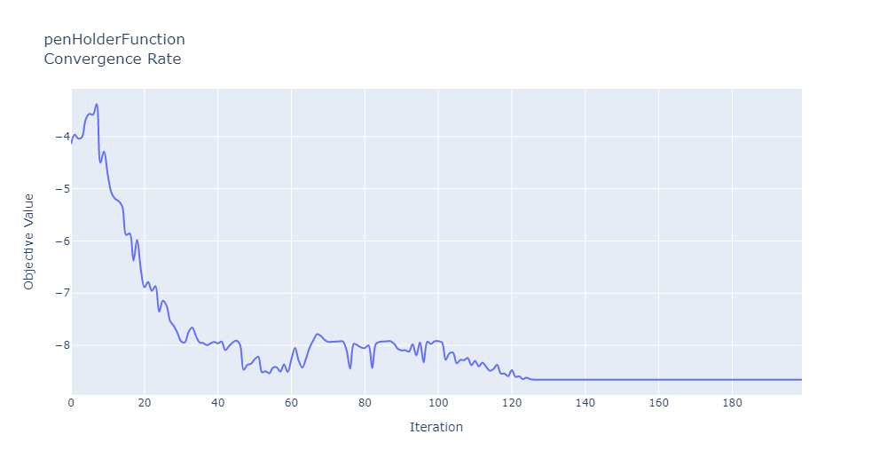
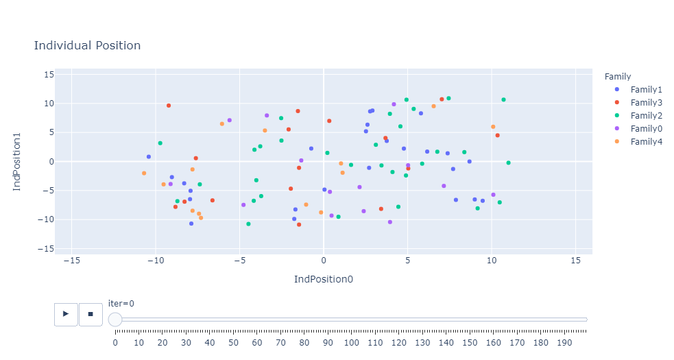
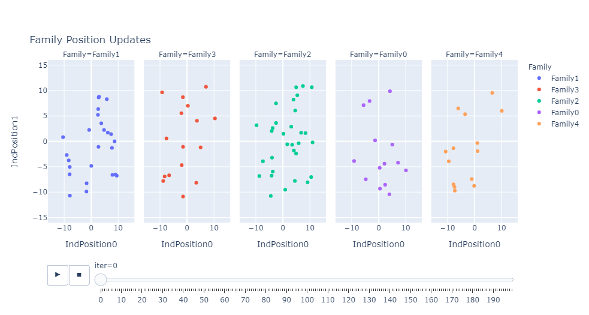

# Ulimisana Optimisation Algorithm

This package is for [Ulimisana Optimisation Algorithm introduced in this paper](https://ieeexplore.ieee.org/document/9205897). The usage of this package should be cited as follows:

@ARTICLE{9205897,
  author={Maumela, Tshifhiwa and Ṋelwamondo, Fulufhelo and Marwala, Tshilidzi},
  journal={IEEE Access}, 
  title={Introducing Ulimisana Optimization Algorithm Based on Ubuntu Philosophy}, 
  year={2020},
  volume={8},
  number={},
  pages={179244-179258},
  doi={10.1109/ACCESS.2020.3026821}}
 
T. Maumela, F. Ṋelwamondo and T. Marwala, "Introducing Ulimisana Optimization Algorithm Based on Ubuntu Philosophy," in IEEE Access, vol. 8, pp. 179244-179258, 2020, doi: 10.1109/ACCESS.2020.3026821.


This document shows how Ulimisana Optimisation Algorithm can be used.

In this document we show how Ulimisa Optimisation Algorithm which is based on the concepts of Ubuntu is used on Python. Ubuntu philosophy is old and consists of many oral proverbs that have been documented in recent years. 

This document also shows how the Ubuntu Incentive Mechanism can be used as well. Ubuntu Incentive Mechanism modelled according to Mechanism Design principles. This incentive scheme is introduced as a fitness function which the algorithm tries to improve.

Trust is an important element within these communities and as such, this package also shows how the Social Trust Network module can be imported independently.

The attrators of Ulimisana Optimisation Algorithm (UOA) can be transformed using linear or sigmoid functions. This package contains these different linear and sigmoid functions which users can choose from. 

Stopping Conditions to stop the simulations once the incremental change is small and also when solution start diverging were not implemented in this package at this moment. 


```python
from ulimisana import testFunctions as tf
from ulimisana import transformFunctions as trf
from ulimisana import agent_positions as ps
from ulimisana import trustworthinessFunction as twf
from ulimisana import ubuntuIncentives as ui

from ulimisana import ulimisana as uoa
```


```python
from ulimisana.ubuntuIncentives import initialise_ubuntuIncentives
from ulimisana.ubuntuIncentives import ubuntuIncentives
```


```python
import ulimisana.ulimisana as uoa
from ulimisana.visualisation import convergenceRatePlot, animated2Dvisualisation
```


```python
help(twf.initialise_trust)
```

    Help on function initialise_trust in module ulimisana.trustworthinessFunction:
    
    initialise_trust(NoOfFamilies)
        This function creates empty dataframes that are used in the STN function
        
        Parameter:
        -----------
            NoOfFamilies : The total number of families in the community
        
        Return:
        ---------
            iter_trustNetwork : An iteration dataframe for trustNetwork
            adv_trustworthiness : An iteration dataframe for advisors' Trustworthiness
    
    

<!-- UOA optimises by maximising the returns within the community. To solve minimisation problems, the object functions are multiplied inside the function thus making the way this package searches so solution to be minimising by default. As such the payoffs (objective values are shown in opposite sign). For example, the payoffs returned by the uoa.ulimisana() needs to be multiplied by -1.  -->

### Benchmark Test Functions

1. easomFunction(x)        : −100 ≤ xi ≤ 100. The global minimum is located at x∗ = f(π, π),f(x∗) = −1
2. bealeFunction(x)        : −4.5 ≤ xi ≤ 4.5. The global minimum is located at x∗ = (3, 0.5), f(x∗) = 0.
3. matyasFunction(x)       : −10 ≤ xi ≤ 10.   The global minimum is located at x∗ = f(0, 0), f(x∗) = 0.
4. bohachevsky1Function(x) : −100 ≤ xi ≤ 100. The global minimum is located at x∗ = f(0, 0), f(x∗) = 0.
4. penHolderFunction(x)    : -11 ≤ xi ≤ 11.   The four global minima are located at x∗ = f(±9.646168, ±9.646168), f(x∗) = −0.96354.
5. wayburnSeader2Function(x): −500 ≤ 500.      The global minimum is located at x∗ = f{(0.2, 1), (0.425, 1)}, f(x∗) = 0.
6. schaffer1Function(x)     : −100 ≤ xi ≤ 100. The global minimum is located at x∗ = f(0, 0),f(x∗) = 0.
7. wolfeFunction(x)         : 0 ≤ xi ≤ 2.     The global minimum is located at x∗ = f(0,0,0),f(x∗) = 0.
8. ackley2Function(x)       : −32 ≤ xi ≤ 32.  The global minimum is located at origin x∗ = (0, 0),f(x∗) = −200.
9. goldsteinpriceFunction(x): −2 ≤ xi ≤ 2.    The global minimum is located at x∗ = f(0,−1), f(x∗) = 3.
10. boothFunction(x)        : −10 ≤ xi ≤ 10.  The global minimum is located at x∗ = f(1,3), f(x∗) = 0.
11. brentFunction(x)        : −20 ≤ xi ≤ 0.   The global minimum is located at x∗ = f(-10,-10), f(x∗) = np.exp(-200)
12. powellsumFunction(x)    : −1 ≤ xi ≤ 1.    The global minimum is located at x∗ = f(0,...,0), f(x∗) = 0

#### To see the constraint boundaries of the test function use the help() function


```python
help(tf.penHolderFunction)
```

    Help on function penHolderFunction in module ulimisana.testFunctions:
    
    penHolderFunction(x)
        subject to −11 ≤ xi ≤ 11. The four global minima are located at x∗ = f(±9.646168, ±9.646168), f(x∗) = −0.96354.
    
    

## Transformation Function
1. tanh(x)
2. linear(x)
3. logistic(x):
4. arctan(x):
5. gudermanannian(x):
6. algebraic(x):
7. erf(x):


```python
time_iter = 200
# Lower bound, Upper bound, Test Function Dimension
lb = -11
ub =  11
dim = 2

# Community size
popSize = 100
# Number of families in community
NoOfFamilies = 5
#Average Weight family and community Payoffs (Fitness values)
fam_aveThreshold = 0.3
com_aveThreshold = 0.3
# Age distributions to determine how many dependents and providers in each family
ageAverage = 35
ageStdev = 7
# Use in determining the Ubuntu Incentive Scheme
phi = 0.7

'''Trustworthiness'''
epsilon = 0.15 
r = 0.7
trustThreshold =0.45

objFunction   = tf.penHolderFunction # Make sure the dimensions, lb and ub chosen align with test function.
sigFun_term   = trf.tanh # Choose between linear and sigmoid transformation function
sigFun_weight = trf.tanh #Choose between linear and sigmoid transformation function

'''
 x_info    : gives you information about each agent. Their age, position at the end of iterations, 
                     their objective value (payoff) and family they belong to.
 x_pos     : gives you the changes in position over all the iterations
 ind_val   : gives you the individual's payoffs for each iteration
 fam_val   : gives you the family' payoffs for each iteration
 com_val   : gives you the cimmunity's pauoffs for each iteration
 adv_trust : gives you the changes of trustworthiness each family had towards their advisrors. 
 trust     : gives you the changes of trustworthiness each family had towards all families (computed using advisor's trustworthiness)

'''

x_info,x_pos,ind_val,fam_val,comm_val,adv_trust,trust_matrix= uoa.ulimisana(time_iter,popSize,NoOfFamilies,ageAverage,ageStdev,
              objFunction,dim,lb,ub,sigFun_term,sigFun_weight,fam_aveThreshold,com_aveThreshold,phi,epsilon,r,
              trustThreshold)
```

    Iteration:  0
    

    C:\Users\Ngwaniwapho\anaconda3\lib\site-packages\ulimisana\ubuntuIncentives.py:177: SettingWithCopyWarning: 
    A value is trying to be set on a copy of a slice from a DataFrame
    
    See the caveats in the documentation: https://pandas.pydata.org/pandas-docs/stable/user_guide/indexing.html#returning-a-view-versus-a-copy
      df['IndPayoff'][df['Family']==i] = indPayoffUpdate
    C:\Users\Ngwaniwapho\anaconda3\lib\site-packages\pandas\core\indexing.py:671: SettingWithCopyWarning: 
    A value is trying to be set on a copy of a slice from a DataFrame
    
    See the caveats in the documentation: https://pandas.pydata.org/pandas-docs/stable/user_guide/indexing.html#returning-a-view-versus-a-copy
      self._setitem_with_indexer(indexer, value)
    

    mean:  -0.44040460341059906
    min :  -0.9601789653882997
    max :  -3.944212436483454e-21
    Iteration:  1
    mean:  -0.44879079458080434
    min :  -0.960682649848431
    max :  -1.688830333760582e-16
    Iteration:  2
    mean:  -0.44539629249912127
    min :  -0.9597988504228043
    max :  -0.0
    Iteration:  3
    mean:  -0.4079594854463801
    min :  -0.9599404492937735
    max :  -0.0
    Iteration:  4
    mean:  -0.39616035873405264
    min :  -0.958943554941131
    max :  -0.0
    Iteration:  5
    mean:  -0.39792376624341363
    min :  -0.953053301321124
    max :  -0.0
    Iteration:  6
    mean:  -0.3751864475542177
    min :  -0.9507642177096556
    max :  -0.0
    Iteration:  7
    mean:  -0.500218882771417
    min :  -0.941832263613856
    max :  -0.0
    Iteration:  8
    mean:  -0.4761446891949376
    min :  -0.9597675919395549
    max :  -8.841561591499726e-69
    Iteration:  9
    mean:  -0.5248631725712368
    min :  -0.9601528483912832
    max :  -3.4960944477545286e-97
    Iteration:  10
    mean:  -0.5636132537468446
    min :  -0.9601528483912832
    max :  -3.477449502940389e-07
    Iteration:  11
    mean:  -0.5768086459213877
    min :  -0.96140105361118
    max :  -4.0334230407658265e-22
    Iteration:  12
    mean:  -0.5819705343155426
    min :  -0.9606207740637608
    max :  -2.063943664763233e-09
    Iteration:  13
    mean:  -0.5935850805387578
    min :  -0.9603792391043066
    max :  -2.8155249489163298e-52
    Iteration:  14
    mean:  -0.6537347083122615
    min :  -0.9602121159539284
    max :  -1.4502788464275272e-06
    Iteration:  15
    mean:  -0.6507089564669937
    min :  -0.9624480105852139
    max :  -9.11270175673631e-58
    Iteration:  16
    mean:  -0.708596111383068
    min :  -0.9620079236753842
    max :  -1.2620898117720922e-14
    Iteration:  17
    mean:  -0.6637582700436859
    min :  -0.9620079236753842
    max :  -0.0
    Iteration:  18
    mean:  -0.7265035226900349
    min :  -0.9620079236753842
    max :  -2.2654541433821018e-51
    Iteration:  19
    mean:  -0.7654273323687824
    min :  -0.9620079236753842
    max :  -1.3132147953868833e-17
    Iteration:  20
    mean:  -0.7539735797610334
    min :  -0.9620877986218984
    max :  -4.4709596311828466e-82
    Iteration:  21
    mean:  -0.7730022076975434
    min :  -0.9622886713501272
    max :  -1.15672687366294e-30
    Iteration:  22
    mean:  -0.762594695631453
    min :  -0.9623841693733303
    max :  -1.6498731870216147e-05
    Iteration:  23
    mean:  -0.8173226996302528
    min :  -0.9620130790449145
    max :  -1.7414186169067283e-14
    Iteration:  24
    mean:  -0.7937634888194729
    min :  -0.9620091622593805
    max :  -3.160866730093804e-08
    Iteration:  25
    mean:  -0.804145415639403
    min :  -0.962007955152581
    max :  -6.55473165619214e-08
    Iteration:  26
    mean:  -0.8372976567610928
    min :  -0.9621146350787118
    max :  -1.1962934785633465e-07
    Iteration:  27
    mean:  -0.8477440770418713
    min :  -0.9620410783085718
    max :  -2.664442763428562e-23
    Iteration:  28
    mean:  -0.8628508307312291
    min :  -0.9621415420609508
    max :  -1.8393009935297148e-05
    Iteration:  29
    mean:  -0.8805260072014858
    min :  -0.9620589583263793
    max :  -4.308484296361458e-25
    Iteration:  30
    mean:  -0.8824750207523284
    min :  -0.9620211951070416
    max :  -1.802268505274895e-05
    Iteration:  31
    mean:  -0.8605001778475619
    min :  -0.9620111505661947
    max :  -6.291837483763149e-07
    Iteration:  32
    mean:  -0.8509584976944491
    min :  -0.9620087380800925
    max :  -3.2889692549341506e-05
    Iteration:  33
    mean:  -0.8686997883309843
    min :  -0.9620085727338269
    max :  -2.6522695570822655e-07
    Iteration:  34
    mean:  -0.8826186862160984
    min :  -0.9620083145641771
    max :  -6.592698167731375e-27
    Iteration:  35
    mean:  -0.8838833218070509
    min :  -0.9620082665379549
    max :  -6.792272632012881e-23
    Iteration:  36
    mean:  -0.8886969943690258
    min :  -0.9620080054557714
    max :  -2.1155244914140377e-11
    Iteration:  37
    mean:  -0.8845018455644035
    min :  -0.9620079431745769
    max :  -1.7595002222781685e-05
    Iteration:  38
    mean:  -0.8817137147146943
    min :  -0.9620079281133208
    max :  -1.9068659998852154e-17
    Iteration:  39
    mean:  -0.8847033896939702
    min :  -0.9620079246842006
    max :  -4.649619301625428e-06
    Iteration:  40
    mean:  -0.8807040593452501
    min :  -0.9620079239183497
    max :  -1.4432352612622717e-07
    Iteration:  41
    mean:  -0.8991762419542623
    min :  -0.9620079237297464
    max :  -9.715171980192697e-06
    Iteration:  42
    mean:  -0.8907116299976937
    min :  -0.9620079236883444
    max :  -2.1139656539491667e-06
    Iteration:  43
    mean:  -0.8828585776832163
    min :  -0.9620079236784844
    max :  -5.913894469776675e-15
    Iteration:  44
    mean:  -0.8787859073231898
    min :  -0.9620079236760131
    max :  -1.3419365833455647e-79
    Iteration:  45
    mean:  -0.8872808150876625
    min :  -0.9620079236770043
    max :  -7.1750927876779165e-34
    Iteration:  46
    mean:  -0.8730633336322496
    min :  -0.9620079236757433
    max :  -2.9901516535535874e-218
    Iteration:  47
    mean:  -0.8714041595443389
    min :  -0.9620079236754697
    max :  -5.7496235729075185e-61
    Iteration:  48
    mean:  -0.8704511673465067
    min :  -0.9620079583354689
    max :  -2.5742528330288277e-46
    Iteration:  49
    mean:  -0.8664057495575846
    min :  -0.962007931756492
    max :  -2.988783946993385e-34
    Iteration:  50
    mean:  -0.8640679037952392
    min :  -0.9620079563343684
    max :  -2.63409126409045e-29
    Iteration:  51
    mean:  -0.8783127717706567
    min :  -0.9620079313125064
    max :  -1.814693950166097e-15
    Iteration:  52
    mean:  -0.8773733862237072
    min :  -0.9620079254755494
    max :  -4.192878791263141e-28
    Iteration:  53
    mean:  -0.8792113840666201
    min :  -0.9620079579436664
    max :  -5.966213986410329e-17
    Iteration:  54
    mean:  -0.8740877271446997
    min :  -0.9620079308087743
    max :  -1.1685064328638295e-22
    Iteration:  55
    mean:  -0.8737261562160292
    min :  -0.9620079570463047
    max :  -7.01625129689949e-44
    Iteration:  56
    mean:  -0.8777271533502757
    min :  -0.9620079308102112
    max :  -0.0
    Iteration:  57
    mean:  -0.871100480564134
    min :  -0.9620079254027925
    max :  -1.8570989174476294e-14
    Iteration:  58
    mean:  -0.8780183997005144
    min :  -0.962007924139262
    max :  -5.806782470595473e-12
    Iteration:  59
    mean:  -0.8663453285732744
    min :  -0.9620079238002057
    max :  -3.5148858222156435e-21
    Iteration:  60
    mean:  -0.8560835412551807
    min :  -0.9620079583117221
    max :  -3.451329478162048e-83
    Iteration:  61
    mean:  -0.8678410407177003
    min :  -0.9620079323952453
    max :  -2.939562490694055e-21
    Iteration:  62
    mean:  -0.8739201858585234
    min :  -0.9620079258207246
    max :  -2.7727351309538664e-07
    Iteration:  63
    mean:  -0.8655570985694616
    min :  -0.9620079579281198
    max :  -7.453075882889081e-11
    Iteration:  64
    mean:  -0.8555071083914001
    min :  -0.9620079525670904
    max :  -2.674614851715208e-23
    Iteration:  65
    mean:  -0.8489191336846231
    min :  -0.9620079319174509
    max :  -2.0550741229326826e-288
    Iteration:  66
    mean:  -0.8434761950655592
    min :  -0.9620079259798394
    max :  -4.277753524035594e-40
    Iteration:  67
    mean:  -0.8450527913825243
    min :  -0.9620079242840763
    max :  -2.03861248709894e-28
    Iteration:  68
    mean:  -0.8486334227383142
    min :  -0.9620079238914603
    max :  -1.1505480398615451e-49
    Iteration:  69
    mean:  -0.8505101556297737
    min :  -0.9620079237322996
    max :  -6.644441821243508e-68
    Iteration:  70
    mean:  -0.8504876342541422
    min :  -0.9620079236955742
    max :  -1.5498710147459382e-88
    Iteration:  71
    mean:  -0.8502987204298381
    min :  -0.9620079236811221
    max :  -3.7905464977942846e-58
    Iteration:  72
    mean:  -0.8501152920475249
    min :  -0.962007923677018
    max :  -2.5184740315498598e-43
    Iteration:  73
    mean:  -0.8501653559100307
    min :  -0.9620079583351858
    max :  -8.584482662911848e-47
    Iteration:  74
    mean:  -0.8578740723458995
    min :  -0.9620079310857796
    max :  -4.702750378556743e-12
    Iteration:  75
    mean:  -0.8751325062559739
    min :  -0.962007925536001
    max :  -3.2983458192417797e-51
    Iteration:  76
    mean:  -0.8857133564017293
    min :  -0.9620079240731676
    max :  -5.721424925721145e-05
    Iteration:  77
    mean:  -0.8888164104644948
    min :  -0.9620079582619523
    max :  -0.007357778226308707
    Iteration:  78
    mean:  -0.8935448095436155
    min :  -0.9620079328348472
    max :  -0.0916261239210204
    Iteration:  79
    mean:  -0.8945720504423557
    min :  -0.9620079261414126
    max :  -0.09230581598257813
    Iteration:  80
    mean:  -0.8889567576695948
    min :  -0.9620079579201907
    max :  -0.07554469190517052
    Iteration:  81
    mean:  -0.8745245450692858
    min :  -0.9620079358326559
    max :  -0.0011264794261438332
    Iteration:  82
    mean:  -0.852528829041569
    min :  -0.9620079266848722
    max :  -1.2383524592312105e-19
    Iteration:  83
    mean:  -0.8505310744221799
    min :  -0.9620079577645952
    max :  -1.2714470273691826e-102
    Iteration:  84
    mean:  -0.8502701693023037
    min :  -0.9620079327043078
    max :  -1.8135159712576385e-55
    Iteration:  85
    mean:  -0.8499874729023255
    min :  -0.962007926146273
    max :  -6.323225509398424e-35
    Iteration:  86
    mean:  -0.8499391043872041
    min :  -0.9620079243673529
    max :  -4.9688551411489356e-30
    Iteration:  87
    mean:  -0.8523793851351874
    min :  -0.9620079238459436
    max :  -2.0310679890896125e-09
    Iteration:  88
    mean:  -0.8966369368276744
    min :  -0.9620079237176168
    max :  -1.7254642898446947e-06
    Iteration:  89
    mean:  -0.8995407259933228
    min :  -0.9620079236857976
    max :  -0.021626013292192877
    Iteration:  90
    mean:  -0.8993598877788008
    min :  -0.9620079583335684
    max :  -0.05020439155480698
    Iteration:  91
    mean:  -0.9023042217356715
    min :  -0.9620079519508564
    max :  -0.09214491269663279
    Iteration:  92
    mean:  -0.8866185942057152
    min :  -0.9620079311194111
    max :  -3.6612579612881936e-05
    Iteration:  93
    mean:  -0.8629734738664923
    min :  -0.9620079257567097
    max :  -1.1686505066483793e-60
    Iteration:  94
    mean:  -0.8508957487354851
    min :  -0.962007924258256
    max :  -2.1727950276732685e-76
    Iteration:  95
    mean:  -0.8692969490387792
    min :  -0.9620079582381758
    max :  -2.4784781968631953e-12
    Iteration:  96
    mean:  -0.8503813268433673
    min :  -0.9620079308910708
    max :  -1.5706808531391739e-68
    Iteration:  97
    mean:  -0.8524697624351082
    min :  -0.9620079570039571
    max :  -4.848043846460799e-31
    Iteration:  98
    mean:  -0.8499854894391089
    min :  -0.9620079318902013
    max :  -8.135243264181724e-35
    Iteration:  99
    mean:  -0.8499367778265071
    min :  -0.9620079258845496
    max :  -1.940443299487586e-29
    Iteration:  100
    mean:  -0.8826151529744692
    min :  -0.9620079241490941
    max :  -0.00020939479806863823
    Iteration:  101
    mean:  -0.8669042346287238
    min :  -0.9620079238103076
    max :  -1.8366330865455527e-05
    Iteration:  102
    mean:  -0.905906120975437
    min :  -0.9620079237116161
    max :  -5.018365280687155e-08
    Iteration:  103
    mean:  -0.9044955433530071
    min :  -0.9620079236882313
    max :  -5.854074369765457e-22
    Iteration:  104
    mean:  -0.927310390495367
    min :  -0.9620079236799295
    max :  -0.0018177360432034002
    Iteration:  105
    mean:  -0.9198350234005541
    min :  -0.9620079236769823
    max :  -0.02078036806848313
    Iteration:  106
    mean:  -0.9204887328066275
    min :  -0.9620079236759359
    max :  -0.1380918472217347
    Iteration:  107
    mean:  -0.9156989141165471
    min :  -0.9620079236755645
    max :  -7.451267152741164e-12
    Iteration:  108
    mean:  -0.9311158055855924
    min :  -0.9620079236754326
    max :  -0.0029957843350676143
    Iteration:  109
    mean:  -0.9218392440406515
    min :  -0.9620079236753858
    max :  -0.0007879562305469154
    Iteration:  110
    mean:  -0.9338753954682724
    min :  -0.9620079236753842
    max :  -0.2118223945313097
    Iteration:  111
    mean:  -0.9255752477018164
    min :  -0.9620079236753842
    max :  -9.944656070903822e-21
    Iteration:  112
    mean:  -0.9345136297770591
    min :  -0.9620079236753842
    max :  -0.04428949930758287
    Iteration:  113
    mean:  -0.9429678984394674
    min :  -0.9620079236753842
    max :  -0.00015672127857598668
    Iteration:  114
    mean:  -0.9395073839057801
    min :  -0.9620079236753842
    max :  -0.001594205099182893
    Iteration:  115
    mean:  -0.9301729947917883
    min :  -0.9620079236753842
    max :  -6.314290969812323e-17
    Iteration:  116
    mean:  -0.9487170775985017
    min :  -0.9620079236753842
    max :  -0.34168048492625874
    Iteration:  117
    mean:  -0.9491193613987216
    min :  -0.9620079236753842
    max :  -5.3328217956189035e-05
    Iteration:  118
    mean:  -0.954532013883815
    min :  -0.9620079236753842
    max :  -0.6450431444908011
    Iteration:  119
    mean:  -0.9415090963277544
    min :  -0.9620079236753842
    max :  -0.28144636700548026
    Iteration:  120
    mean:  -0.956058677971565
    min :  -0.9620079236753842
    max :  -0.6025035828959885
    Iteration:  121
    mean:  -0.9548388926220991
    min :  -0.9620079236753842
    max :  -0.3450473665961887
    Iteration:  122
    mean:  -0.9607963341187385
    min :  -0.9620079236753842
    max :  -0.9211541613598638
    Iteration:  123
    mean:  -0.9575518290182287
    min :  -0.9620079236753842
    max :  -0.7404147824544765
    Iteration:  124
    mean:  -0.9609145194797004
    min :  -0.9620079236753842
    max :  -0.906611631550272
    Iteration:  125
    mean:  -0.9618401472200127
    min :  -0.9620079236753842
    max :  -0.9536587378474719
    Iteration:  126
    mean:  -0.9619815481413511
    min :  -0.9620079236753842
    max :  -0.9605523234742144
    Iteration:  127
    mean:  -0.9620029711227056
    min :  -0.9620079236753842
    max :  -0.9617076906708499
    Iteration:  128
    mean:  -0.9620068253465496
    min :  -0.9620079236753842
    max :  -0.9619391797534756
    Iteration:  129
    mean:  -0.9620076665622027
    min :  -0.9620079236753842
    max :  -0.9619916973477086
    Iteration:  130
    mean:  -0.962007862647777
    min :  -0.9620079236753842
    max :  -0.9620040644857335
    Iteration:  131
    mean:  -0.9620079091413796
    min :  -0.9620079236753842
    max :  -0.9620070041486696
    Iteration:  132
    mean:  -0.9620079202112628
    min :  -0.9620079236753842
    max :  -0.9620077044847783
    Iteration:  133
    mean:  -0.9620079228495655
    min :  -0.9620079236753842
    max :  -0.9620078714207644
    Iteration:  134
    mean:  -0.9620079234785055
    min :  -0.9620079236753842
    max :  -0.962007911217674
    Iteration:  135
    mean:  -0.9620079236284458
    min :  -0.9620079236753842
    max :  -0.9620079207053988
    Iteration:  136
    mean:  -0.9620079236641924
    min :  -0.9620079236753842
    max :  -0.9620079229673226
    Iteration:  137
    mean:  -0.9620079236727145
    min :  -0.9620079236753842
    max :  -0.9620079235065782
    Iteration:  138
    mean:  -0.9620079236747462
    min :  -0.9620079236753842
    max :  -0.9620079236351398
    Iteration:  139
    mean:  -0.9620079236752305
    min :  -0.9620079236753842
    max :  -0.9620079236657897
    Iteration:  140
    mean:  -0.9620079236753462
    min :  -0.9620079236753842
    max :  -0.9620079236730967
    Iteration:  141
    mean:  -0.9620079236753738
    min :  -0.9620079236753842
    max :  -0.9620079236748388
    Iteration:  142
    mean:  -0.9620079236753801
    min :  -0.9620079236753842
    max :  -0.9620079236752541
    Iteration:  143
    mean:  -0.9620079236753817
    min :  -0.9620079236753842
    max :  -0.9620079236753531
    Iteration:  144
    mean:  -0.9620079236753821
    min :  -0.9620079236753842
    max :  -0.9620079236753625
    Iteration:  145
    mean:  -0.9620079236753821
    min :  -0.9620079236753842
    max :  -0.9620079236753625
    Iteration:  146
    mean:  -0.9620079236753822
    min :  -0.9620079236753842
    max :  -0.9620079236753625
    Iteration:  147
    mean:  -0.9620079236753822
    min :  -0.9620079236753842
    max :  -0.9620079236753625
    Iteration:  148
    mean:  -0.9620079236753822
    min :  -0.9620079236753842
    max :  -0.9620079236753625
    Iteration:  149
    mean:  -0.9620079236753822
    min :  -0.9620079236753842
    max :  -0.9620079236753625
    Iteration:  150
    mean:  -0.9620079236753822
    min :  -0.9620079236753842
    max :  -0.9620079236753625
    Iteration:  151
    mean:  -0.9620079236753822
    min :  -0.9620079236753842
    max :  -0.9620079236753625
    Iteration:  152
    mean:  -0.9620079236753822
    min :  -0.9620079236753842
    max :  -0.9620079236753625
    Iteration:  153
    mean:  -0.9620079236753822
    min :  -0.9620079236753842
    max :  -0.9620079236753625
    Iteration:  154
    mean:  -0.9620079236753822
    min :  -0.9620079236753842
    max :  -0.9620079236753625
    Iteration:  155
    mean:  -0.9620079236753822
    min :  -0.9620079236753842
    max :  -0.9620079236753625
    Iteration:  156
    mean:  -0.9620079236753822
    min :  -0.9620079236753842
    max :  -0.9620079236753625
    Iteration:  157
    mean:  -0.9620079236753822
    min :  -0.9620079236753842
    max :  -0.9620079236753625
    Iteration:  158
    mean:  -0.9620079236753822
    min :  -0.9620079236753842
    max :  -0.9620079236753625
    Iteration:  159
    mean:  -0.9620079236753822
    min :  -0.9620079236753842
    max :  -0.9620079236753625
    Iteration:  160
    mean:  -0.9620079236753822
    min :  -0.9620079236753842
    max :  -0.9620079236753625
    Iteration:  161
    mean:  -0.9620079236753822
    min :  -0.9620079236753842
    max :  -0.9620079236753625
    Iteration:  162
    mean:  -0.9620079236753822
    min :  -0.9620079236753842
    max :  -0.9620079236753625
    Iteration:  163
    mean:  -0.9620079236753822
    min :  -0.9620079236753842
    max :  -0.9620079236753625
    Iteration:  164
    mean:  -0.9620079236753822
    min :  -0.9620079236753842
    max :  -0.9620079236753625
    Iteration:  165
    mean:  -0.9620079236753822
    min :  -0.9620079236753842
    max :  -0.9620079236753625
    Iteration:  166
    mean:  -0.9620079236753822
    min :  -0.9620079236753842
    max :  -0.9620079236753625
    Iteration:  167
    mean:  -0.9620079236753822
    min :  -0.9620079236753842
    max :  -0.9620079236753625
    Iteration:  168
    mean:  -0.9620079236753822
    min :  -0.9620079236753842
    max :  -0.9620079236753625
    Iteration:  169
    mean:  -0.9620079236753822
    min :  -0.9620079236753842
    max :  -0.9620079236753625
    Iteration:  170
    mean:  -0.9620079236753822
    min :  -0.9620079236753842
    max :  -0.9620079236753625
    Iteration:  171
    mean:  -0.9620079236753822
    min :  -0.9620079236753842
    max :  -0.9620079236753625
    Iteration:  172
    mean:  -0.9620079236753822
    min :  -0.9620079236753842
    max :  -0.9620079236753625
    Iteration:  173
    mean:  -0.9620079236753822
    min :  -0.9620079236753842
    max :  -0.9620079236753625
    Iteration:  174
    mean:  -0.9620079236753822
    min :  -0.9620079236753842
    max :  -0.9620079236753625
    Iteration:  175
    mean:  -0.9620079236753822
    min :  -0.9620079236753842
    max :  -0.9620079236753625
    Iteration:  176
    mean:  -0.9620079236753822
    min :  -0.9620079236753842
    max :  -0.9620079236753625
    Iteration:  177
    mean:  -0.9620079236753822
    min :  -0.9620079236753842
    max :  -0.9620079236753625
    Iteration:  178
    mean:  -0.9620079236753822
    min :  -0.9620079236753842
    max :  -0.9620079236753625
    Iteration:  179
    mean:  -0.9620079236753822
    min :  -0.9620079236753842
    max :  -0.9620079236753625
    Iteration:  180
    mean:  -0.9620079236753822
    min :  -0.9620079236753842
    max :  -0.9620079236753625
    Iteration:  181
    mean:  -0.9620079236753822
    min :  -0.9620079236753842
    max :  -0.9620079236753625
    Iteration:  182
    mean:  -0.9620079236753822
    min :  -0.9620079236753842
    max :  -0.9620079236753625
    Iteration:  183
    mean:  -0.9620079236753822
    min :  -0.9620079236753842
    max :  -0.9620079236753625
    Iteration:  184
    mean:  -0.9620079236753822
    min :  -0.9620079236753842
    max :  -0.9620079236753625
    Iteration:  185
    mean:  -0.9620079236753822
    min :  -0.9620079236753842
    max :  -0.9620079236753625
    Iteration:  186
    mean:  -0.9620079236753822
    min :  -0.9620079236753842
    max :  -0.9620079236753625
    Iteration:  187
    mean:  -0.9620079236753822
    min :  -0.9620079236753842
    max :  -0.9620079236753625
    Iteration:  188
    mean:  -0.9620079236753822
    min :  -0.9620079236753842
    max :  -0.9620079236753625
    Iteration:  189
    mean:  -0.9620079236753822
    min :  -0.9620079236753842
    max :  -0.9620079236753625
    Iteration:  190
    mean:  -0.9620079236753822
    min :  -0.9620079236753842
    max :  -0.9620079236753625
    Iteration:  191
    mean:  -0.9620079236753822
    min :  -0.9620079236753842
    max :  -0.9620079236753625
    Iteration:  192
    mean:  -0.9620079236753822
    min :  -0.9620079236753842
    max :  -0.9620079236753625
    Iteration:  193
    mean:  -0.9620079236753822
    min :  -0.9620079236753842
    max :  -0.9620079236753625
    Iteration:  194
    mean:  -0.9620079236753822
    min :  -0.9620079236753842
    max :  -0.9620079236753625
    Iteration:  195
    mean:  -0.9620079236753822
    min :  -0.9620079236753842
    max :  -0.9620079236753625
    Iteration:  196
    mean:  -0.9620079236753822
    min :  -0.9620079236753842
    max :  -0.9620079236753625
    Iteration:  197
    mean:  -0.9620079236753822
    min :  -0.9620079236753842
    max :  -0.9620079236753625
    Iteration:  198
    mean:  -0.9620079236753822
    min :  -0.9620079236753842
    max :  -0.9620079236753625
    Iteration:  199
    mean:  -0.9620079236753822
    min :  -0.9620079236753842
    max :  -0.9620079236753625
    

#### Individual's Convergence Curve


```python
fig = convergenceRatePlot(ind_val,objFunction)
```

<!--  -->


#### Family Convergence Curve


```python
fig = convergenceRatePlot(fam_val,objFunction)
```



#### Community Payoff Convergence Curve


```python
fig = convergenceRatePlot(comm_val,objFunction)
```




```python
fig1,fig2 = animated2Dvisualisation(x_info,x_pos,lb,ub)
```





The Source Code for this Package can be found in https://github.com/Ubuntu-AI/Ulimisana_Optimisation_Algorithm

For all suggestions and collaboration requests, send email to the Ubuntu AI Research Group at ubuntu.inspired.ai@gmail.com

Lead developer is Tshifhiwa Maumela.
The Algorithm was invented by:
1. Tshifhiwa Maumela
2. Fulufhelo Ṋelwamondo
3. Tshilidzi Marwala


```python

```
